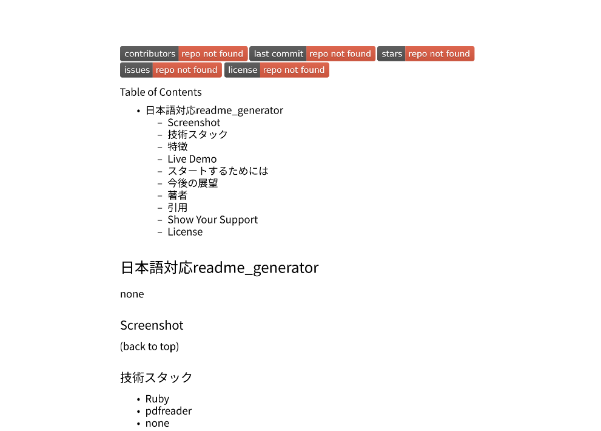

<a name="readme-top"></a>
[](https://github.com/shopippi/JP_README_Generator/graphs/contributors)
[](https://github.com/shopippi/JP_README_Generator/commits/main)
[](https://github.com/shopippi/JP_README_Generator/stargazers)
[](https://github.com/shopippi/JP_README_Generator/issues)
[](https://github.com/shopippi/JP_README_Generator/blob/main/LICENSE)

<details>
<summary>Table of Contents</summary>

- [ JP_readme_generator](#about-project)
  - [ Screenshot](#screenshot)
  - [ 技術スタック](#tech-stack)
  - [ 特徴](#key-features)
  - [ Live Demo](#live-demo)
  - [ スタートするためには](#getting-started)
  - [ 今後の展望](#future-features)
  - [ 著者](#author)
  - [ 引用](#contribution)
  - [ Show Your Support](#support)
  - [ License](#license)
</details>

#  JP_readme_generator <a name="about-project"></a>

このプログラムを作成するにあたって背景として、gitを使用する際、README.mdファイルの作製が面倒であった。UNIXベースのOSでgitを使用するとなった場合に、さらにいちいちゼロから直打ちで作製する事に煩わしさを覚えていた。
Readmeファイルを質問に答える形で半自動での作製をしてくれるツールは既に存在しているが、質問形式で日本語の対応のmdファイルを作成する事が出来なかった。

私の主な貢献は以下のとおりである。
- 質問形式で回答していく半自動readme.mdジェネレーターの日本語版対応のupgrade.
- 同時に、日本語で記述されたmarkdownファイルのpdf化の実装.

##  Screenshot <a name="screenshot"></a>

実際に生成されたpdfファイルは以下の通りとなっている。





<p align="right">(<a href="#readme-top">back to top</a>)</p>

##  技術スタック  <a name="tech-stack"></a>
- Ruby
- mupdf (to check result)

<p align="right">(<a href="#readme-top">back to top</a>)</p>

##  特徴  <a name="key-features"></a>
- このプログラムを実行すると、煩わしかったreadme.mdを"日本語で"書き出してくれます。
- 出力されたmdファイルをpdfに書き出してくれます。
- 書き出されたファイルは、実行したディレクトリに保存されます。

<p align="right">(<a href="#readme-top">back to top</a>)</p>

##  実行するためには  <a name="getting-started"></a>

ローカルにインストールしたのちに、実行してください。
### Prerequisites

プログラム実行に必要なパッケージなど [Ruby](https://www.ruby-lang.org/en/) installed on your machine.

### Setup

セットアップの方法.

```sh
cd my-project
git clone git@github.com:shopippi/JP_README_generator.git .
```

### Installation

インストール方法:

```sh
sudo chmod +x ./main
```
optional
```sh
echo $PATH
```
optional
```sh
mv .././JP_README_generator ./$PATH
```


### Usage

プログラムの使い方:

```sh
./main
```

### Run tests

プログラムの実行方法:

それぞれの質問に答えていくと、それに基づいてファイルを生成してくれます。
```sh
GitHub Username >> 
Your Name >> 
Your Email >>
Your LinkedIn >>
Repo Name >> 
Project Title >> 
Description >> 
Demo Link >> 
License Type >> 
Choose Interpreter: ["node", "ruby"] >>
Tech Stack [1] >> 
Tech Stack [2] >> 
Tech Stack [3] >>
Features [1] >> 
Features [2] >> 
Future Features [1] >> 
Future Features [2] >> 
Include TOC? ["y", "n"] >> 
Include Screenshot? ["y", "n"] >> 
```

<p align="right">(<a href="#readme-top">back to top</a>)</p>

##  著者  <a name="author"></a>

**shopippi**

[](https://github.com/shopippi)
[]([https://linkedin.com/in/https://www.linkedin.com/in/shotaro-takahashi-962949298](https://www.linkedin.com/in/shotaro-takahashi-962949298?utm_source=share&utm_campaign=share_via&utm_content=profile&utm_medium=ios_app))
[](mailto:takahashi@shopippi.com)

<p align="right">(<a href="#readme-top">back to top</a>)</p>

##  今後の展望  <a name="future-features"></a>
- [ ] 特定ファイルから定型文を読み込む。例:githubやlinkedinのアカウント情報
- [ ] 保存先を訪ねる
- [ ] 絵文字への対応

<p align="right">(<a href="#readme-top">back to top</a>)</p>

##  引用  <a name="contribution"></a>

https://github.com/IndieCoderMM/readme-generator


https://fonts.google.com/


https://qiita.com/chihayafuru/items/f48f088dbb231fd6d13b


https://qiita.com/mitsu48/items/34875bbc8ba00760fe27

<p align="right">(<a href="#readme-top">back to top</a>)</p>

##  Show Your Support  <a name="support"></a>

If you like this project, please consider giving it a star.

<p align="right">(<a href="#readme-top">back to top</a>)</p>

##  License <a name="license"></a>

This project is [MIT](./LICENSE) licensed.

<p align="right">(<a href="#readme-top">back to top</a>)</p>

*This readme is generated by [readme-generator](https://github.com/IndieCoderMM/readme-generator)*
*And shopippi contributed to the Japanese localization and template enhancement.
